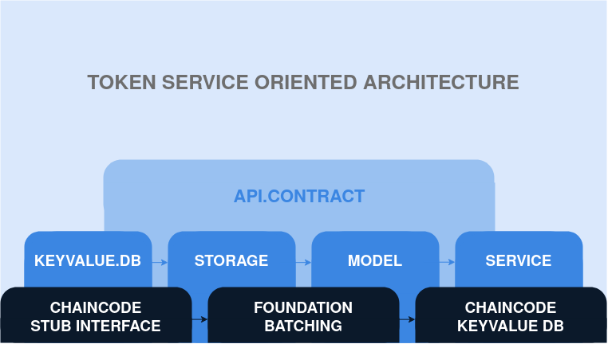

# Token Overview and Its Architecture

## Description

The "Token" project is an implementation of a token based on Hyperledger Fabric. The main goal of this project is to provide clarity, maintainability, testability, extensibility, and debuggability of the token system.

The system is built upon three main layers:

- The Hyperledger Fabric layer, responsible for interacting with the blockchain, storing and processing transactions.

- The token service layer, where the business entities are stored, token business logic is executed, and data is processed.

- The API contract layer, which handles external calls and facilitates interaction with external systems.

The implemented architecture allows for fast and efficient testing without a real blockchain infrastructure. Each layer of the project has been carefully designed and optimized to ensure maximum performance and ease of use.

The project is developed following best practices in software development and architecture.

## TOC

- [Overview](#token-overview-and-its-architecture)
    - [Description](#description)
    - [TOC](#toc)
    - [Hyperledger Fabric Layer](#hyperledger-fabric-layer)
        - [ChaincodeStubInterface](#chaincodestubinterface)
        - [Foundation and Batching](#foundation-and-batching)
        - [Implementation of Chaincode key-value DB Interface](#implementation-of-chaincode-key-value-db-interface)
    - [Token Service Layer](#token-service-layer)
        - [Key-value Database Abstraction](#key-value-database-abstraction)
        - [Storage Layer and Repository](#storage-layer-and-repository)
        - [Data Model](#data-model)
        - [Service Layer and Controller](#service-layer-and-controller)
    - [API Contract Layer](#api-contract-layer)
        - [Data Transfer Objects (DTOs)](#data-transfer-objects-dtos)
        - [Access Check Helper Functions](#access-check-helper-functions)
        - [Contract Transaction and Query API Calls](#contract-transaction-and-query-api-calls)
    - [Build and Initialization](#build-and-initialization)
    - [License](#license)
    - [Links](#links)

## Hyperledger Fabric Layer

### ChaincodeStubInterface
The ChaincodeStubInterface is the primary interface in Hyperledger Fabric for interacting with the ledger.

### Foundation and Batching
The Foundation is a wrapper around the ChaincodeStubInterface, adding transaction batching functionality, which optimizes and simplifies transaction processing.

### Implementation of Chaincode key-value DB Interface
The Chaincode key-value DB is an implementation of the key-value database abstraction, directly related to the Foundation, and tailored to the specific features of Hyperledger Fabric environment.

## Token Service Layer

### Key-value Database Abstraction
Introduces an abstraction in the form of the keyvalue.DB interface, which allows for unified data handling and decouples the dependency on a specific database implementation.

### Storage Layer and Repository
The storage package operates on model objects using the keyvalue.DB. Interfaces for the repository package are automatically generated, enabling testing of other packages without relying on the real storage.

### Data Model
The model package contains the business entities representing the main data structures used by the system.

### Service Layer and Controller
The service layer, represented by the service package, contains all the token business logic. It operates on model objects and saves everything to storage through the repository interface.

## API Contract Layer

### Data Transfer Objects (DTOs)
DTOs are objects designed for data exchange between different layers of the architecture and external calls.

### Access Check Helper Functions
Functions that assist in access control to various parts of the API, enhancing security and access management.

### Contract Transaction and Query API Calls
The Contract handles all external calls, checks permissions for the calls, parses the incoming DTO, maps it to the model, invokes the service through the controller interface, retrieves the response, maps it to the DTO, and sends it back to the calling side.

## Build and Initialization
All dependencies and initialization of project components occur in [main.go](main.go). Reviewing this file can help understand the overall project structure and the relationships between its components.

## License

[Apache-2.0](https://www.apache.org/licenses/LICENSE-2.0)

## Links

No additional links provided.